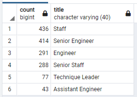
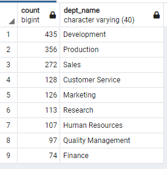

# Pewlett-Hackard-Analysis

## Overview
This analysis aims to help get ahead of the 'Silver-Tsunami" retirment wave by determining the number of retiring employees per title, and identify employees who are eligible to participate in a mentorship program. 

## Results
- There are 90,398 employees set to retire making up 30% of the total work force within the company. 
- 64% of employees set to reitre hold senior positions. 
- The total number of employees eligible for the mentorship program is 1,549. 
- Only two managers are set to retire, but no current managers qualify for the mentorship program. 

## Summary 
90,398 roles will need to be filled in total as the 'Silver tsunami' retirement wave hits the company. Senior staff make up 45% of the mentorship eligible employees which will aid in ushering in the new generation of Pewlett Hackard upper level staff. If the entire workforce was assigned a mentor, each mentor would have roughly 194 pupils. This number drops significantly when considering not every company employee will be considered for advancement. The following tables below showcase the mentorship eligibility by title and department:

   Mentorship Eligibility by Title

  

   Mentorship Eligibility by Department

  

[See ](./Queries/Employee_Database_challenge.sql)
